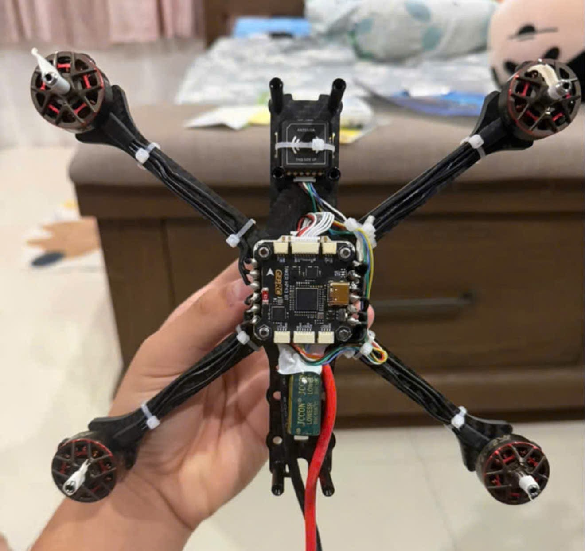
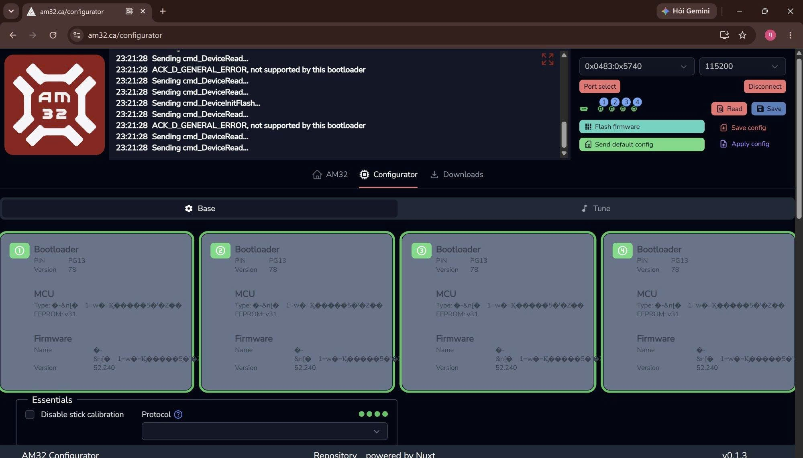
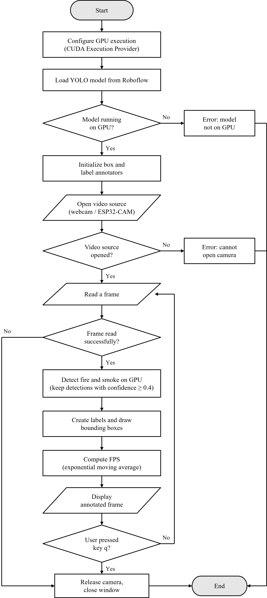

# Edudrone: Build Log
## About the Project
### Where it started: Edudrone

Edudrone began as a teaching tool. I used to run drone workshops for kids, and I always told them that underneath everything, a drone is just an ESC, a flight controller, and motors. But I could never actually show them. The only drone I had to teach with was a DJI Tello: it flew well, but there was nothing to open up, nothing to point at and explain.

So the first goal was simple: build a drone from open, off-the-shelf parts that students could take apart and understand, while still running real flight firmware. Before buying real parts, I practiced the fundamentals on a Meteor65 Pro: flashing firmware, binding a receiver to a transmitter, and basic tuning. The first build was a 5-inch freestyle quad.

### The new direction: Rapid Scout, a fire-scouting drone

When finished my 5-inch drone, I started planning for a new mission that my drone could do based on some interesting features of FPV drone such as GPS mapping and Poshold. 

The idea behind Rapid Scout:

The drone flies a pre-planned GPS route over the area being monitored.
A downward-facing camera streams video back to a ground station over WiFi.
A YOLO object-detection model running on the ground station's GPU looks for fire and smoke in real time.
When fire or smoke is detected, the GPS coordinates and the frame that triggered the detection are sent to a human operator.
The fire and smoke detection code for the ground station is in
[`fire_detection_gpu.py`](fire_detection_gpu.py).

## Phase 1: Edudrone - How I Chose My Setup

### Choosing a Drone Class: Microdrone, Freestyle, or Long Range

FPV drones are usually grouped by propeller size, and that size roughly decides what the drone is good at.

A microdrone, or whoop, runs 1 to 2 inch propellers. It's small, light, safe to fly indoors, and forgiving for someone just learning the sticks.

A freestyle drone runs 5 inch propellers, sometimes 4 or 6 inch. This is the class most people picture when they think FPV: fast, agile, built for tricks and tight maneuvering.

A long range drone runs 7 inch propellers or bigger. Bigger props move more air per rotation, so the drone trades some agility for efficiency and flight time, which is what long range is actually for.

Edudrone started as a freestyle build, 5 inch propellers, and only later moved toward long range once the mission changed.

### Practice Phase: Meteor65 Pro

Before committing to real parts, I bought a Meteor65 Pro and a RadioMaster controller, not to fly for fun but to practice the fundamentals: flashing firmware onto a flight controller, binding a receiver to a transmitter, basic tuning.

I got the version without a camera and VTX, since I wanted to practice flying and tuning rather than FPV racing. If you're using a RadioMaster 2.4GHz ELRS controller like I am, pick the ELRS 2.4G RX version.

### Core Hardware: What Are ESC and FC

Before picking parts, it helps to know what a 5 inch drone actually needs underneath.

The ESC, or Electronic Speed Controller, usually comes as a "4-in-1" board that controls all four motors' speed based on signals from the flight controller.

The FC, or Flight Controller, is the brain. It runs firmware like INAV, Betaflight, or ArduPilot, reads data from the gyroscope, accelerometer, GPS, and compass, and sends output commands to the ESC.

### What I Actually Chose

Stack: GEPRC Taker H743BT flight controller. The ESC was originally the stock one bundled with the stack, but I later replaced it with a Flywoo GOKU G55M 55A 4-in-1 ESC after solder damage.

Motor: AxisFlying 1960KV.

Receiver: GEPRC ELRS.

GPS module: GEPRC GEP-M10Q

### Soldering: Temperature and Technique

The cheap soldering iron I first bought from the market couldn't get solder to flow evenly onto a pad no matter what I tried. I switched to an FNIRSI HS-01 (the HS-02 has more features if you want them), and while I was still getting used to the new iron, I ruined my first ESC: solder smeared around the board instead of sitting cleanly on the pad. That mistake also took out my GPS module and receiver, damaged by the same bad soldering job.

Motor pads need around 350°C, ESC pads around 400°C. Pre-tin the wire and the pad separately, apply flux first, and use 63/37 solder since it sets fast and leaves fewer cold joints.

I ended up replacing the damaged ESC with a Flywoo GOKU G55M 55A 4-in-1, which has a pad-hole design that makes soldering noticeably easier than the stock board.

One small trick: if a motor spins the wrong direction, you can reverse it by swapping any two of the three motor-to-ESC wires, no need to re-flash anything.

Safety tip: always route the first battery plug-in after soldering through a smoke stopper. If there's a short, you'll know before anything burns.

### Flashing Firmware: Starting with Betaflight, Then Switching to INAV

Flashing firmware on the GEPRC Taker H743BT works the same whether you're using Betaflight or INAV. Here's the process I followed:

1. Open the Board & Build tab in the firmware flasher and select the exact target, GEPRC_TAKER_H743. It shows a "Community/Manufacturer supported, not officially supported" warning, which is normal for this board.
2. In Build Configuration, set Radio Protocol to CRSF and Motor Protocol to DSHOT.
3. Match the other options (GPS, Optical Flow, Pin IO, Range Finder, VTX) to your actual hardware.
4. Go to the Flash tab, choose Load Firmware [Online], then Flash Firmware.
5. Verify the flash worked by checking gyro and accelerometer response in the Setup tab.

I flashed Betaflight first, then flashed INAV onto the same board using the exact same steps.

Betaflight doesn't have Position Hold mode, by design, since it's built for manual, freestyle, and racing flight. INAV does have it. Since RapidScout needs the drone to hold a stable position over a target, switching to INAV wasn't optional. It was a requirement, not just curiosity about trying a different firmware.

### FC Setup: Receiver and GPS

On the Receiver tab, set Receiver Mode to Serial (via UART), Serial Receiver Provider to CRSF, and enable Serial RX on UART2. My receiver is a GEPRC ELRS, which needs an ELRS 2.4GHz transmitter to bind to.

For GPS, connect it to UART4, set Sensor Input to GPS, and set the baud rate to 115200.

### First Test Flight and Tuning

If you're used to the gentle feel of a small DJI Tello, switching to a 5 inch drone like mine, you might be a little shocked by how sensitive the yaw stick is.

The first skill worth learning is hovering the drone in one spot. For beginners, I'd recommend bringing the motor output limit down to around 80-90%, and flattening the Expo curve so it's less steep near the center of the stick. This keeps the drone calmer for small corrections while still letting you reach full rotation rate at full stick deflection. You'll find this under the Rates tab in Betaflight, or the Rate profile in INAV.

---

## Phase 2: RapidScout — Giving the Drone a Mission

### From Edudrone to RapidScout

After I got the drone flying, I had an idea: fly the drone at altitude, scan the ground below with a camera, and detect smoke and fire, then report back to a device by sending GPS coordinates.

The drone flies a pre-mapped GPS route. A WiFi camera streams video to a self-trained YOLOv5 model that looks for smoke and fire. When something is detected, the GPS coordinates and the frame that triggered the detection get sent to a human operator. The drone doesn't take any action on its own, it just reports.

To make that happen, the first thing I needed was a drone that could fly steady, hold its position well, and stop drifting.

### The ESC Incident

With the drone flying, I wanted to smooth it out further before mapping any routes. Mid test flight, I noticed a strange pattern: holding the throttle steady, motors 1 and 4 would drop their output while motors 2 and 3 spiked up, one diagonal pair moving opposite the other.

I opened AM32 Configurator to check the ESC parameters, motor KV, poles, timing. I adjusted the values and hit Save, but after a power cycle, none of it had actually changed. I tried again, checking all four ESCs this time, same result. Then I checked Stuck Motor Protection, and all four ESC status icons flipped from green to red, stuck in Bootloader.

I didn't stop to figure out why. I moved straight to Flash Firmware instead.

The target dropdown showed NOT FOUND, no auto-detection. I looked up the exact part printed on the ESC, a Flywoo GOKU G55M 128K 3-6S 55A, and cross-referenced it against AM32's firmware source on GitHub, the targets.h file, to find the right target manually.

I found a GitHub issue on INAV describing a bug where the flight controller blocks passthrough writes to the ESC, which matched what I was seeing. I backed up the entire INAV configuration first with the CLI diff all command, gyro and accelerometer calibration, PID profiles, the mixer, pin profiles, so I could restore everything exactly no matter what happened next. Then I flashed Betaflight onto the FC.

Flashing the ESC through Betaflight produced the exact same stuck-at-Sending result.

I decided to stop experimenting on this ESC, and went looking through what I had left. I found a spare GEPRC 4-in-1 board I'd set aside, which had a single unrelated bad XT60 solder joint from earlier.

I managed to resolder a spare GEPRC ESC, and verified it with a smoke stopper and a multimeter across the XT60 pads. But I'd put all my attention on the big XT60 pad and soldered the motor wires more carelessly, figuring a smaller pad meant no risk of a cold joint. The cold joint was hidden inside, looking fine from the outside, and a static continuity test didn't catch it. When I pushed the throttle to max to test the motors, the strong vibration snapped the wire loose from the joint, causing a short and burning the circuit.

Since the motor set was ruined anyway, I decided to use the moment to move up to a 7 inch long range frame, lower KV motors for steadier flight, more room to carry electronics, and longer range.

### What I Took Away

Save not saving, the icon turning red, getting stuck in Bootloader, three warning signs in a row that should have made me stop, but I kept going straight to Flash Firmware instead of stopping to ask why.

Repeating an action that can't be undone, even when it fails with the exact same error every time, is what directly killed 3 of the 4 motors on the main board, and worse, I kept clicking it over and over, each time a chance to stop that I didn't take.

The CLI diff all backup I ran before switching firmware to test the INAV theory ended up saving the entire evening later on, when the spare board came back to life. Paste one command, and the PID, mixer, and calibration were back exactly as they'd been. Without it, all that earlier tuning would have just been gone.

### Current progress

#### Done

Hardware design for the 7-inch build. Parts selected and documented: TBS Source One V6 7" DC frame, ZTM 2807 1300KV motors, Gemfan 7050 props, GEPRC Taker H65 4-in-1 ESC, 6S 3300mAh LiPo, carried over from the earlier build: GEPRC Taker H743 BT flight controller (INAV), GEP-M10Q GPS with compass, and GEPRC ELRS receiver. I currently use an ESP32-CAM to handles video.

 **Fire and smoke detection on the ground station.** 

  It runs locally on an NVIDIA RTX 3050 Laptop GPU using a public YOLOv11
  fire/smoke model from Roboflow Universe (ONNX Runtime with CUDA). It has been
  tested with a laptop webcam and runs in real time, with a check that forces
  the model onto the GPU instead of silently falling back to the CPU.

Code: [`fire_detection_gpu.py`](fire_detection_gpu.py)
  
Algorithm flowchart:
    

#### In progress

Reading GPS data from the flight controller through the ESP32 (over MSP) and sending it to the ground station, so every detection can be tagged with a location.
Assembling the 7-inch drone as parts arrive.

#### Next

Switch the video source from the webcam to the ESP32-CAM stream.
Set up autonomous waypoint missions and return-to-home failsafe in INAV.
Field test: burn a small pile of dry wood, fly the drone over it, and check that the fire is detected and its GPS position is reported correctly.

---

## References

- [GEPRC Taker H743BT FC Manual](docs/TAKER-H743-BT-FC-Manual.pdf)
- [Fire & Smoke Detection model (Roboflow)](https://universe.roboflow.com/fire-detection-2x0mw/fire-smoke-detection-zszdt-bhuqo)
- [Meteor65 Pro II O4 Brushless Whoop Quadcopter](https://betafpv.com/products/meteor65-pro-ii-o4-brushless-whoop-quadcopter?variant=44067835084934)
- [Flywoo GOKU G55M 32bit 128K 3-6S 55A 4-in-1 ESC](https://www.defiancerc.com/products/flywoo-goku-g55m-32bit-128k-3-6s-55a-4-in-1-esc-30x30)
