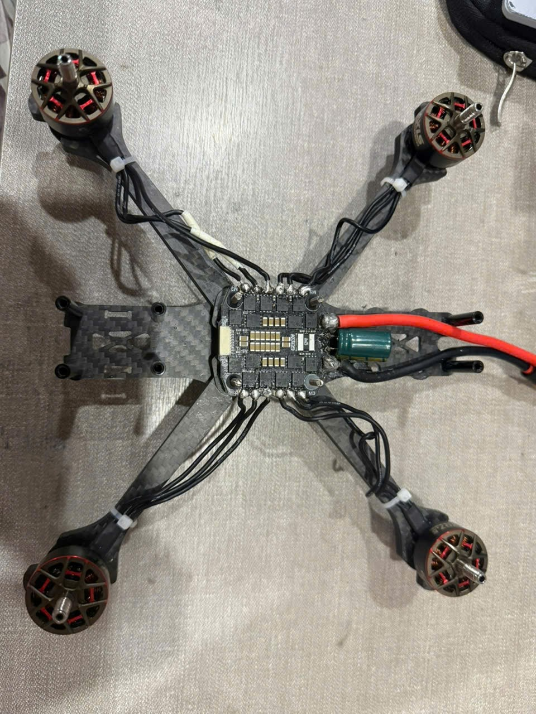

# Edudrone: Build Log

I used to run drone workshops for kids, and I'd tell them that underneath everything, a drone is just an ESC, an FC, and motors. But I could never actually show them that. All I had on hand to teach with was a DJI Tello, which flew great and came apart for nothing, nothing to open up, nothing to point at and explain. That gap was what pushed me to build a drone with hardware I could actually open, take apart, and explain, even though it would still need real firmware to fly. That part was something to learn properly, not something to dodge.

## Phase 1: Edudrone - How I Chose My Setup

### Choosing a Drone Class: Microdrone, Freestyle, or Long Range

FPV drones are usually grouped by propeller size, and that size roughly decides what the drone is good at.

A microdrone, or whoop, runs 1 to 2 inch propellers. It's small, light, safe to fly indoors, and forgiving for someone just learning the sticks.

A freestyle drone runs 5 inch propellers, sometimes 4 or 6 inch. This is the class most people picture when they think FPV: fast, agile, built for tricks and tight maneuvering.

A long range drone runs 7 inch propellers or bigger. Bigger props move more air per rotation, so the drone trades some agility for efficiency and flight time, which is what long range is actually for.

Edudrone started as a freestyle build, 5 inch propellers, and only later moved toward long range once the mission changed.

### Practice Phase: Meteor65 Pro

Before committing to real parts, I bought a Meteor65 Pro and a RadioMaster controller, not to fly for fun but to practice the fundamentals: flashing firmware onto a flight controller, binding a receiver to a transmitter, basic tuning.

I got the version without a camera and VTX, since I wanted to practice flying and tuning rather than FPV racing. If you're using a RadioMaster 2.4GHz ELRS controller like I am, pick the ELRS 2.4G RX version.

### Core Hardware: What Are ESC and FC

Before picking parts, it helps to know what a 5 inch drone actually needs underneath.

The ESC, or Electronic Speed Controller, usually comes as a "4-in-1" board that controls all four motors' speed based on signals from the flight controller.

The FC, or Flight Controller, is the brain. It runs firmware like INAV, Betaflight, or ArduPilot, reads data from the gyroscope, accelerometer, GPS, and compass, and sends output commands to the ESC.

### What I Actually Chose

Stack: GEPRC Taker H743BT flight controller. The ESC was originally the stock one bundled with the stack, but I later replaced it with a Flywoo GOKU G55M 55A 4-in-1 ESC after solder damage (more on that below).

Motor: AxisFlying 1960KV.

Receiver: GEPRC ELRS.

GPS module: GEPRC GEP-M10Q

### Soldering: Temperature and Technique

The cheap soldering iron I first bought from the market couldn't get solder to flow evenly onto a pad no matter what I tried. I switched to an FNIRSI HS-01 (the HS-02 has more features if you want them), and while I was still getting used to the new iron, I ruined my first ESC: solder smeared around the board instead of sitting cleanly on the pad. That mistake also took out my GPS module and receiver, damaged by the same bad soldering job.

Motor pads need around 350°C, ESC pads around 400°C. Pre-tin the wire and the pad separately, apply flux first, and use 63/37 solder since it sets fast and leaves fewer cold joints.

I ended up replacing the damaged ESC with a Flywoo GOKU G55M 55A 4-in-1, which has a pad-hole design that makes soldering noticeably easier than the stock board.

One small trick: if a motor spins the wrong direction, you can reverse it by swapping any two of the three motor-to-ESC wires, no need to re-flash anything.

Safety tip: always route the first battery plug-in after soldering through a smoke stopper. If there's a short, you'll know before anything burns.

### Flashing Firmware: Starting with Betaflight, Then Switching to INAV

Flashing firmware on the GEPRC Taker H743BT works the same whether you're using Betaflight or INAV. Here's the process I followed:

1. Open the Board & Build tab in the firmware flasher and select the exact target, GEPRC_TAKER_H743. It shows a "Community/Manufacturer supported, not officially supported" warning, which is normal for this board.
2. In Build Configuration, set Radio Protocol to CRSF and Motor Protocol to DSHOT.
3. Match the other options (GPS, Optical Flow, Pin IO, Range Finder, VTX) to your actual hardware.
4. Go to the Flash tab, choose Load Firmware [Online], then Flash Firmware.
5. Verify the flash worked by checking gyro and accelerometer response in the Setup tab.

I flashed Betaflight first, then flashed INAV onto the same board using the exact same steps.

Betaflight doesn't have Position Hold mode, by design, since it's built for manual, freestyle, and racing flight. INAV does have it. Since RapidScout needs the drone to hold a stable position over a target, switching to INAV wasn't optional. It was a requirement, not just curiosity about trying a different firmware.

### FC Setup: Receiver and GPS

On the Receiver tab, set Receiver Mode to Serial (via UART), Serial Receiver Provider to CRSF, and enable Serial RX on UART2. My receiver is a GEPRC ELRS, which needs an ELRS 2.4GHz transmitter to bind to.

For GPS, connect it to UART4, set Sensor Input to GPS, and set the baud rate to 115200.

### First Test Flight and Tuning

If you're used to the gentle feel of a small DJI Tello, switching to a 5 inch drone like mine, you might be a little shocked by how sensitive the yaw stick is.

The first skill worth learning is hovering the drone in one spot. For beginners, I'd recommend bringing the motor output limit down to around 80-90%, and flattening the Expo curve so it's less steep near the center of the stick. This keeps the drone calmer for small corrections while still letting you reach full rotation rate at full stick deflection. You'll find this under the Rates tab in Betaflight, or the Rate profile in INAV.

---

## Phase 2: RapidScout — Giving the Drone a Mission

### From Edudrone to RapidScout

After I got the drone flying, I had an idea: fly the drone at altitude, scan the ground below with a camera, and detect smoke and fire, then report back to a device by sending GPS coordinates.

The drone flies a pre-mapped GPS route. A WiFi camera streams video to a self-trained YOLOv5 model that looks for smoke and fire. When something is detected, the GPS coordinates and the frame that triggered the detection get sent to a human operator. The drone doesn't take any action on its own, it just reports.

To make that happen, the first thing I needed was a drone that could fly steady, hold its position well, and stop drifting.

### The ESC Incident: Three Days Debugging Bootloader

With the drone flying, I wanted to smooth it out further before mapping any routes. Mid test flight, I noticed a strange pattern: holding the throttle steady, motors 1 and 4 would drop their output while motors 2 and 3 spiked up, one diagonal pair moving opposite the other.

I opened AM32 Configurator to check the ESC parameters, motor KV, poles, timing. I adjusted the values and hit Save, but after a power cycle, none of it had actually changed. I tried again, checking all four ESCs this time, same result. Then I checked Stuck Motor Protection, and all four ESC status icons flipped from green to red, stuck in Bootloader.

I didn't stop to figure out why. I moved straight to Flash Firmware instead.

The target dropdown showed NOT FOUND, no auto-detection. I looked up the exact part printed on the ESC, a Flywoo GOKU G55M 128K 3-6S 55A, and cross-referenced it against AM32's firmware source on GitHub, the targets.h file, to find the right target manually.

I found a GitHub issue on INAV describing a bug where the flight controller blocks passthrough writes to the ESC, which matched what I was seeing. I backed up the entire INAV configuration first with the CLI diff all command, gyro and accelerometer calibration, PID profiles, the mixer, pin profiles, so I could restore everything exactly no matter what happened next. Then I flashed Betaflight onto the FC to isolate the variable, confirming the target as GEPRC_TAKER_H743.

Flashing the ESC through Betaflight produced the exact same stuck-at-Sending result. Same failure on two completely different flight controller firmwares ruled out INAV specifically as the cause.

I decided to stop experimenting on the main board while it still worked, and went looking through what I already had. I found a spare GEPRC 4-in-1 board I'd set aside, which had a single unrelated bad XT60 solder joint from earlier.

Before putting real power through the spare board, I ran it through a proper check: visual inspection of the solder joints, a multimeter continuity and resistance check across the terminals to rule out a short, a smoke stopper test, then DC voltage checks at several points, the XT60 input, the replaced capacitor legs, the 5V BEC pin.

Once it cleared every check, I flashed INAV back onto it and restored the entire configuration by pasting the diff all backup into the CLI. PID, mixer, calibration, mode switches, all back exactly where they'd been. The spare board flew again.

Test flights afterward still didn't show a clean pattern. In calm conditions, with no wind, the drone would just drift without settling in any one direction. I took the props off, put the drone on a table, and pulled the roll stick to watch the motors directly. This time it was motors 1 and 3 climbing while 2 and 4 slowed down, a different pairing than the first incident. The solder was fine, so I suspected AM32 and the ESC again, just like before.

Sure enough, AM32 wouldn't save the changes again, and flashing gave a new error this time, ACK_D_GENERAL_ERROR, not supported by this bootloader.

I followed the same playbook as before, backed up with diff all, switched to Betaflight, but the same error kept showing up.

This time I didn't dig for the root cause. I moved straight to another spare board instead, to avoid losing more time.

I managed to resolder this spare GEP ESC, and verified it with a smoke stopper and a multimeter across the XT60 pads. But I'd put all my attention on the big XT60 pad and soldered the motor wires more carelessly, figuring a smaller pad meant no risk of a cold joint. The cold joint was hidden inside, looking fine from the outside, and a static continuity test didn't catch it. When I pushed the throttle to max to test the motors, the strong vibration snapped the wire loose from the joint, causing a short and burning the circuit.

Since the motor set was ruined anyway, I decided to use the moment to move up to a 7 inch long range frame, lower KV motors for steadier flight, more room to carry electronics, and longer range.

### What I Took Away From Those Days

Save not saving, the icon turning red, getting stuck in Bootloader, three warning signs in a row that should have made me stop, but I kept going straight to Flash Firmware instead of stopping to ask why.

Repeating an action that can't be undone, even when it fails with the exact same error every time, is what directly killed 3 of the 4 motors on the main board, and worse, I kept clicking it over and over, each time a chance to stop that I didn't take.

The CLI diff all backup I ran before switching firmware to test the INAV theory ended up saving the entire evening later on, when the spare board came back to life. Paste one command, and the PID, mixer, and calibration were back exactly as they'd been. Without it, all that earlier tuning would have just been gone.

### Currently Working On

I'm researching how a microcontroller like the ESP32-S3 can send flight commands directly to the FC. In parallel, I'm rebuilding and re-tuning the drone once the 7 inch frame is ready.

For the smoke and fire detection model, I'm currently testing an existing model on Roboflow rather than training my own from scratch, since sourcing a training dataset has been the hardest part, I can really only scrape Google Images for training data. The model I'm testing runs on 25k images with a mAP@50 of 92.3%, precision of 98.5%, and recall of 86.1%, which looks solid enough to work with. I'm running it through an ESP32-CAM, which can handle onboard inference. (Test script: [`code/Drone_AI_detection.py`](code/Drone_AI_detection.py))

---

## References

- [GEPRC Taker H743BT FC Manual](docs/TAKER-H743-BT-FC-Manual.pdf)
- [Fire & Smoke Detection model (Roboflow)](https://universe.roboflow.com/fire-detection-2x0mw/fire-smoke-detection-zszdt-bhuqo)
- [Meteor65 Pro II O4 Brushless Whoop Quadcopter](https://betafpv.com/products/meteor65-pro-ii-o4-brushless-whoop-quadcopter?variant=44067835084934)
- [Flywoo GOKU G55M 32bit 128K 3-6S 55A 4-in-1 ESC](https://www.defiancerc.com/products/flywoo-goku-g55m-32bit-128k-3-6s-55a-4-in-1-esc-30x30)
